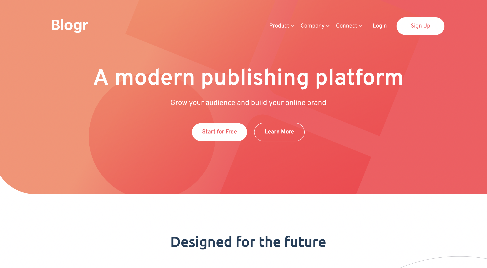

# Frontend Mentor - Blogr landing page solution

This is a solution to the [Blogr landing page challenge](https://www.frontendmentor.io/challenges/blogr-landing-page-EX2RLAApP) on Frontend Mentor

## Table of contents

-  [Overview](#overview)
   -  [The challenge](#the-challenge)
   -  [Screenshot](#screenshot)
   -  [Links](#links)
-  [My process](#my-process)
   -  [Built with](#built-with)
   -  [What I learned](#what-i-learned)
   -  [Continued development](#continued-development)
   -  [Useful resources](#useful-resources)
-  [Author](#author)

## Overview

### The challenge

Your users should be able to:

-  View the optimal layout for the site depending on their device's screen size
-  See hover states for all interactive elements on the page

### Screenshot



### Links

-  Live Site URL: https://bloggr-landing-page-jjw.netlify.app

## My process

### Built with

-  Semantic HTML5 markup
-  Mobile-first workflow
-  Flexbox
-  JavaScript

### What I learned

```html
<div
   class="header__mobilebg-nav-container hidden hamburger-hidden"
   id="mobile-nav"
>
   <nav class="header__nav">...</nav>
</div>
```

I originally struggled with writing the HTML markup that accomodated for both the mobile and desktop navigation designs. However, upon further research I realsied that it was perfectly ok to create an entirely separate section of markup for the mobile layout, which would ultimately be rendered invisible at wider viewports. I was also able to make use of the BEM naming convention to help differentiate between both sections of markup within the header, while styling them in a related manner within my stylesheets.

```css
.header {
   background: linear-gradient(
         to top,
         hsl(356, 100%, 66%),
         rgba(255, 143, 112)
      ), url('/images/bg-pattern-intro.svg');
   background-blend-mode: soft-light;
}
```

The header design in this project provided a great means to practicing background SVG placement and responsiveness, whilst also controlling how it blended with a gradient applied over the top. Since a gradient is technically a background-image I had to practice layering multiple background images on top of one another. I was suprised at the extent to which applying a different `background-blend-mode` would completely change the accented colour displayed throughout the SVG itself, instead of manually change the fill colour.

```css
.future-container {
   background-position: calc(100% + 240px) 60%;
   background-size: 700px;
}

.future__flex-parent::before {
   position: absolute;
   left: 60%;
   top: 50%;
}
```

By far the most challenging feature of this project was controlling the responsiveness of the primary background images within the main sections of content. This was not too difficult to achieve for mobile and tablet devices, since I was able to place them within a responsive flex container to keep them aligned with the rest of the content.

However, I had to learn and implement the CSS `calc()` function to achieve the design of keeping both images pinned to opposite sides of the viewport, especially as both sides grew further. Using a calc value of 100% plus a desired fixed amount would pin the image to the right viewport edge, whilst a value of 0% minus a fixed amount would do so to the left.

For ultra-wide desktops I decided to position the images in relation to their corresponding empty flex container, so they would respond in line with the centered content.

```css
.infastructure__phones-parent {
   min-height: 3.5rem;
}

.infastructure__phones-img {
   top: -177px;
   right: 8%;
   width: 600px;
}
```

The mobile phone image provided a great challenge in using both relative and absolute units, in order to control when the asset would grow and when it would stay pinned with changing sections of content. In order to match the original design at mobile and tablet devices, I had to apply a `min-height` to its parent flex container to create the room (since both a fixed and `max-height` did not work). This would then need to be reset at wider screen sizes since by default the flex parent would respond all child heights to match that minimun value.

As for the phone image itself, I applied a fuild size so it would grow up to wider screens, where I then overrode that value with a fixed size whilst changing its relatively-positioned parent to the background flex-child. This also allowed it to respond in line with the primary content when the primary maximum width hit.

```js
const [header, hamburgerBtn, arrows] = [
   domSelect('.header'),
   domSelect('#hamburger'),
   domSelectAll('.arrow'),
]
```

I was proud of my ability to use destructuring in this project, in a simple attempt to save unnecessary lines of code. However, I need to be aware of situations where it would be more readable to declare multiple variables on different lines.

### Continued development

For future projects, I would like to learn more about complicated CSS animations, although I realise this can have negative impacts on accessibility and should only be used where appropiate.

Furthermore, I feel as if I relied too heavily on the CSS `clamp()` function to increase font sizes to fill the space between tablets and desktops. The resulting font size appeared unecessarily large and reduced the visual distinction between different levels of text (headings and paragraphs).

### Useful resources

-  [Min(), Max() & Clamp()](https://www.youtube.com/watch?v=U9VF-4euyRo&ab_channel=KevinPowell) - This was a great video by Kevin explaining some of the methods we can use to achieve 'fluid topography' between different viewport sizes. We can also make use of feature queries to create fallbacks to support older browsers that don't yet recognise these properties.

## Author

-  Website - [Joshua Jameson-Wallis](https://joshuajamesonwallis.com)
-  Linkedin - [Joshua Jameson-Wallis](https://www.linkedin.com/in/joshua-jameson-wallis/)
